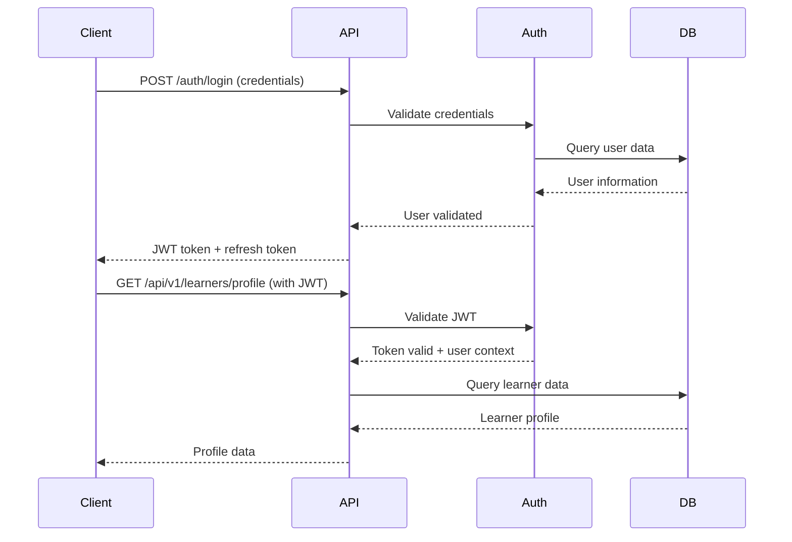

# API Architecture Specification
**Adaptive Learning System**

**Version:** 1.0  
**Date:** January 2025  
**Status:** Final  
**Author:** System Architecture Team  

---

## Table of Contents

1. [Executive Summary](#executive-summary)
2. [API Design Principles](#api-design-principles)
3. [API Architecture Overview](#api-architecture-overview)
4. [Authentication & Authorization](#authentication--authorization)
5. [Core API Endpoints](#core-api-endpoints)
6. [Data Models & Schemas](#data-models--schemas)
7. [Error Handling & Response Formats](#error-handling--response-formats)
8. [Rate Limiting & Throttling](#rate-limiting--throttling)
9. [API Versioning Strategy](#api-versioning-strategy)
10. [Security Considerations](#security-considerations)
11. [Performance & Caching](#performance--caching)
12. [Documentation & Testing](#documentation--testing)
13. [Monitoring & Analytics](#monitoring--analytics)

---

## Executive Summary

This document defines the comprehensive API architecture for the Adaptive Learning System, built on FastAPI framework. The API follows RESTful principles with GraphQL capabilities for complex queries, implements robust security measures, and provides scalable endpoints for learner management, content delivery, progress tracking, and adaptive algorithm integration.

### Key Features
- **RESTful Design:** Clean, intuitive endpoint structure
- **FastAPI Framework:** High-performance async API with automatic documentation
- **JWT Authentication:** Secure token-based authentication with role-based access
- **Real-time Capabilities:** WebSocket support for live progress tracking
- **Comprehensive Validation:** Pydantic models for request/response validation
- **Auto-documentation:** OpenAPI/Swagger integration

---

## API Design Principles

### 1. RESTful Architecture
- **Resource-based URLs:** `/api/v1/learners/{id}/progress`
- **HTTP Methods:** GET, POST, PUT, PATCH, DELETE for appropriate operations
- **Stateless Design:** Each request contains all necessary information
- **Consistent Naming:** Plural nouns for collections, clear hierarchies

### 2. Security First
- **Authentication Required:** All endpoints require valid JWT tokens
- **Authorization Checks:** Role-based access control (RBAC)
- **Input Validation:** Comprehensive validation using Pydantic models
- **Rate Limiting:** Prevent abuse and ensure fair usage

### 3. Performance Optimization
- **Async Operations:** Non-blocking I/O for high concurrency
- **Caching Strategy:** Redis-based caching for frequently accessed data
- **Pagination:** Efficient data retrieval for large datasets
- **Compression:** GZIP compression for response optimization

### 4. Developer Experience
- **Auto-documentation:** Interactive Swagger UI and ReDoc
- **Consistent Responses:** Standardized response formats
- **Clear Error Messages:** Detailed error information for debugging
- **SDK Support:** Client libraries for common programming languages

---

## API Architecture Overview

### High-Level Architecture

```
┌─────────────────────────────────────────────────────────────────┐
│                        Client Applications                      │
│  ┌─────────────┐  ┌─────────────┐  ┌─────────────┐             │
│  │   Web App   │  │ Mobile App  │  │ Third-party │             │
│  │  (React)    │  │ (Flutter)   │  │    APIs     │             │
│  └─────────────┘  └─────────────┘  └─────────────┘             │
└─────────────────────┬───────────────────────────────────────────┘
                      │ HTTPS/WSS
┌─────────────────────▼───────────────────────────────────────────┐
│                    API Gateway                                  │
│              (Kong/AWS API Gateway)                             │
│  ┌─────────────────────────────────────────────────────────┐   │
│  │ Rate Limiting │ Authentication │ Logging │ Monitoring  │   │
│  └─────────────────────────────────────────────────────────┘   │
└─────────────────────┬───────────────────────────────────────────┘
                      │
┌─────────────────────▼───────────────────────────────────────────┐
│                   FastAPI Application                          │
│  ┌─────────────┐  ┌─────────────┐  ┌─────────────┐             │
│  │   REST API  │  │  GraphQL    │  │  WebSocket  │             │
│  │ Endpoints   │  │   Query     │  │   Server    │             │
│  └─────────────┘  └─────────────┘  └─────────────┘             │
│                                                                 │
│  ┌─────────────┐  ┌─────────────┐  ┌─────────────┐             │
│  │ Auth Layer  │  │ Validation  │  │   Caching   │             │
│  │   (JWT)     │  │ (Pydantic)  │  │   (Redis)   │             │
│  └─────────────┘  └─────────────┘  └─────────────┘             │
└─────────────────────┬───────────────────────────────────────────┘
                      │
┌─────────────────────▼───────────────────────────────────────────┐
│                  Business Logic Layer                          │
│  ┌─────────────┐  ┌─────────────┐  ┌─────────────┐             │
│  │  Adaptive   │  │  Content    │  │  Progress   │             │
│  │ Algorithm   │  │ Management  │  │  Tracking   │             │
│  └─────────────┘  └─────────────┘  └─────────────┘             │
└─────────────────────┬───────────────────────────────────────────┘
                      │
┌─────────────────────▼───────────────────────────────────────────┐
│                   Data Access Layer                            │
│  ┌─────────────┐  ┌─────────────┐  ┌─────────────┐             │
│  │  MongoDB    │  │    Redis    │  │  External   │             │
│  │   Atlas     │  │   Cache     │  │   APIs      │             │
│  └─────────────┘  └─────────────┘  └─────────────┘             │
└─────────────────────────────────────────────────────────────────┘
```

### API Layers

| Layer | Purpose | Technologies |
|-------|---------|-------------|
| **Gateway** | Traffic management, security, monitoring | Kong/AWS API Gateway |
| **Application** | API endpoints, business logic | FastAPI, Python |
| **Authentication** | User authentication and authorization | JWT, OAuth2 |
| **Validation** | Request/response validation | Pydantic |
| **Caching** | Performance optimization | Redis |
| **Database** | Data persistence | MongoDB Atlas |

---

## Authentication & Authorization

### Authentication Flow



### JWT Token Structure

```json
{
  "header": {
    "alg": "HS256",
    "typ": "JWT"
  },
  "payload": {
    "sub": "user_id_12345",
    "email": "learner@example.com",
    "role": "learner",
    "permissions": ["read:profile", "write:progress"],
    "exp": 1640995200,
    "iat": 1640908800,
    "iss": "adaptive-learning-system"
  }
}
```

### Role-Based Access Control (RBAC)

| Role | Permissions | Description |
|------|-------------|-------------|
| **Learner** | `read:profile`, `write:progress`, `read:content` | Standard learner access |
| **Educator** | `read:learners`, `write:content`, `read:analytics` | Teacher/instructor access |
| **Admin** | `*:*` | Full system access |
| **API_Client** | `read:public_data` | Third-party API access |

### Authentication Endpoints

```python
# Authentication endpoints
POST   /auth/login           # User login
POST   /auth/logout          # User logout
POST   /auth/refresh         # Refresh JWT token
POST   /auth/register        # User registration
POST   /auth/forgot-password # Password reset request
POST   /auth/reset-password  # Password reset confirmation
GET    /auth/verify-email    # Email verification
```

---

## Core API Endpoints

### 1. Learner Management

```python
# Learner profile management
GET    /api/v1/learners/profile              # Get current learner profile
PUT    /api/v1/learners/profile              # Update learner profile
DELETE /api/v1/learners/profile              # Delete learner account

# Learner preferences
GET    /api/v1/learners/preferences          # Get learning preferences
PUT    /api/v1/learners/preferences          # Update preferences

# Learner competencies
GET    /api/v1/learners/competencies         # Get skill competencies
POST   /api/v1/learners/competencies         # Update competency data
```

### 2. Content Management

```python
# Content discovery
GET    /api/v1/content                       # List available content
GET    /api/v1/content/{content_id}          # Get specific content
GET    /api/v1/content/search               # Search content

# Adaptive content delivery
GET    /api/v1/content/recommended           # Get personalized recommendations
GET    /api/v1/content/next                 # Get next recommended content
POST   /api/v1/content/{content_id}/start   # Start content session

# Content metadata
GET    /api/v1/content/{content_id}/metadata # Get content metadata
GET    /api/v1/content/categories           # List content categories
GET    /api/v1/content/difficulty-levels    # List difficulty levels
```

### 3. Progress Tracking

```python
# Progress management
GET    /api/v1/progress                      # Get overall progress
GET    /api/v1/progress/{skill_id}           # Get skill-specific progress
POST   /api/v1/progress/update              # Update progress data

# Assessment results
POST   /api/v1/assessments/{assessment_id}/submit  # Submit assessment
GET    /api/v1/assessments/results          # Get assessment results
GET    /api/v1/assessments/history          # Get assessment history

# Performance analytics
GET    /api/v1/analytics/performance        # Get performance metrics
GET    /api/v1/analytics/learning-path      # Get learning path analytics
GET    /api/v1/analytics/time-spent         # Get time tracking data
```

### 4. Adaptive Algorithm Integration

```python
# Bayesian Knowledge Tracing
GET    /api/v1/bkt/skill-mastery            # Get skill mastery probabilities
POST   /api/v1/bkt/update-evidence          # Update evidence for BKT
GET    /api/v1/bkt/learning-trajectory      # Get predicted learning path

# Personalization
GET    /api/v1/personalization/recommendations  # Get personalized content
POST   /api/v1/personalization/feedback     # Submit feedback for algorithm
GET    /api/v1/personalization/model-state  # Get current model state
```

### 5. Real-time Features (WebSocket)

```python
# WebSocket endpoints
WS     /ws/progress                         # Real-time progress updates
WS     /ws/notifications                    # Real-time notifications
WS     /ws/collaborative                    # Collaborative learning features
```

---

## Data Models & Schemas

### Learner Profile Schema

```python
from pydantic import BaseModel, EmailStr
from typing import Optional, List
from datetime import datetime

class LearnerProfile(BaseModel):
    id: str
    email: EmailStr
    first_name: str
    last_name: str
    date_of_birth: Optional[datetime]
    learning_preferences: LearningPreferences
    accessibility_needs: Optional[List[str]]
    created_at: datetime
    updated_at: datetime

class LearningPreferences(BaseModel):
    learning_style: str  # visual, auditory, kinesthetic
    difficulty_preference: str  # adaptive, challenging, comfortable
    session_duration: int  # preferred session length in minutes
    notification_settings: NotificationSettings

class NotificationSettings(BaseModel):
    email_notifications: bool = True
    push_notifications: bool = True
    progress_reminders: bool = True
```

### Content Schema

```python
class Content(BaseModel):
    id: str
    title: str
    description: str
    content_type: str  # lesson, exercise, assessment
    difficulty_level: int  # 1-10 scale
    estimated_duration: int  # minutes
    prerequisites: List[str]  # skill IDs
    learning_objectives: List[str]
    tags: List[str]
    metadata: ContentMetadata
    created_at: datetime
    updated_at: datetime

class ContentMetadata(BaseModel):
    author: str
    version: str
    language: str
    accessibility_features: List[str]
    interactive_elements: List[str]
```

### Progress Schema

```python
class ProgressUpdate(BaseModel):
    learner_id: str
    content_id: str
    skill_id: str
    performance_score: float  # 0.0 - 1.0
    time_spent: int  # seconds
    completion_status: str  # started, in_progress, completed
    confidence_level: Optional[float]  # self-reported 0.0 - 1.0
    timestamp: datetime

class SkillMastery(BaseModel):
    skill_id: str
    mastery_probability: float  # BKT output 0.0 - 1.0
    evidence_count: int
    last_updated: datetime
    confidence_interval: Tuple[float, float]
```

---

## Error Handling & Response Formats

### Standard Response Format

```python
class APIResponse(BaseModel):
    success: bool
    data: Optional[Any] = None
    message: Optional[str] = None
    errors: Optional[List[str]] = None
    metadata: Optional[Dict[str, Any]] = None

# Success response example
{
    "success": true,
    "data": {
        "id": "learner_123",
        "name": "John Doe",
        "progress": 0.75
    },
    "message": "Profile retrieved successfully",
    "metadata": {
        "timestamp": "2025-01-15T10:30:00Z",
        "version": "1.0"
    }
}
```

### Error Response Format

```python
class ErrorResponse(BaseModel):
    success: bool = False
    error_code: str
    message: str
    details: Optional[Dict[str, Any]] = None
    timestamp: datetime

# Error response example
{
    "success": false,
    "error_code": "VALIDATION_ERROR",
    "message": "Invalid input data",
    "details": {
        "field": "email",
        "issue": "Invalid email format"
    },
    "timestamp": "2025-01-15T10:30:00Z"
}
```

### HTTP Status Codes

| Status Code | Usage | Description |
|-------------|-------|-------------|
| **200** | Success | Request successful |
| **201** | Created | Resource created successfully |
| **400** | Bad Request | Invalid request data |
| **401** | Unauthorized | Authentication required |
| **403** | Forbidden | Insufficient permissions |
| **404** | Not Found | Resource not found |
| **422** | Validation Error | Request validation failed |
| **429** | Rate Limited | Too many requests |
| **500** | Server Error | Internal server error |

---

## Rate Limiting & Throttling

### Rate Limiting Strategy

```python
# Rate limits by endpoint category
RATE_LIMITS = {
    "authentication": "10/minute",      # Login attempts
    "content_read": "1000/hour",        # Content retrieval
    "progress_update": "100/minute",    # Progress submissions
    "analytics": "50/hour",             # Analytics queries
    "admin": "500/hour"                 # Admin operations
}

# Rate limiting headers
X-RateLimit-Limit: 1000
X-RateLimit-Remaining: 999
X-RateLimit-Reset: 1640995200
```

### Implementation

```python
from fastapi import HTTPException
from slowapi import Limiter, _rate_limit_exceeded_handler
from slowapi.util import get_remote_address

limiter = Limiter(key_func=get_remote_address)

@app.get("/api/v1/content")
@limiter.limit("1000/hour")
async def get_content(request: Request):
    # Endpoint implementation
    pass
```

---

## API Versioning Strategy

### Versioning Approach
- **URL Path Versioning:** `/api/v1/`, `/api/v2/`
- **Backward Compatibility:** Maintain previous versions for 12 months
- **Deprecation Notice:** 6-month advance notice for version deprecation

### Version Management

```python
# Version routing
@app.get("/api/v1/learners/profile")
async def get_profile_v1():
    # Version 1 implementation
    pass

@app.get("/api/v2/learners/profile")
async def get_profile_v2():
    # Version 2 implementation with enhanced features
    pass

# Version information endpoint
@app.get("/api/version")
async def get_api_version():
    return {
        "current_version": "v2",
        "supported_versions": ["v1", "v2"],
        "deprecated_versions": [],
        "sunset_dates": {
            "v1": "2025-12-31"
        }
    }
```

---

## Security Considerations

### Input Validation

```python
from pydantic import validator, Field

class LearnerRegistration(BaseModel):
    email: EmailStr
    password: str = Field(..., min_length=8, max_length=128)
    first_name: str = Field(..., min_length=1, max_length=50)
    
    @validator('password')
    def validate_password(cls, v):
        if not re.search(r'[A-Z]', v):
            raise ValueError('Password must contain uppercase letter')
        if not re.search(r'[a-z]', v):
            raise ValueError('Password must contain lowercase letter')
        if not re.search(r'\d', v):
            raise ValueError('Password must contain digit')
        return v
```

### SQL Injection Prevention
- **MongoDB:** Use parameterized queries and ODM (Motor/Beanie)
- **Input Sanitization:** Validate all inputs using Pydantic
- **Query Building:** Use safe query builders, avoid string concatenation

### CORS Configuration

```python
from fastapi.middleware.cors import CORSMiddleware

app.add_middleware(
    CORSMiddleware,
    allow_origins=["https://app.adaptivelearning.com"],
    allow_credentials=True,
    allow_methods=["GET", "POST", "PUT", "DELETE"],
    allow_headers=["*"],
)
```

---

## Performance & Caching

### Caching Strategy

```python
import redis
from functools import wraps

redis_client = redis.Redis(host='localhost', port=6379, db=0)

def cache_response(expiration=300):
    def decorator(func):
        @wraps(func)
        async def wrapper(*args, **kwargs):
            cache_key = f"{func.__name__}:{hash(str(args) + str(kwargs))}"
            cached_result = redis_client.get(cache_key)
            
            if cached_result:
                return json.loads(cached_result)
            
            result = await func(*args, **kwargs)
            redis_client.setex(cache_key, expiration, json.dumps(result))
            return result
        return wrapper
    return decorator

@app.get("/api/v1/content/{content_id}")
@cache_response(expiration=600)  # Cache for 10 minutes
async def get_content(content_id: str):
    # Implementation
    pass
```

### Database Optimization

```python
# MongoDB indexes for performance
db.learners.create_index([("email", 1)], unique=True)
db.progress.create_index([("learner_id", 1), ("timestamp", -1)])
db.content.create_index([("tags", 1), ("difficulty_level", 1)])
db.competencies.create_index([("learner_id", 1), ("skill_id", 1)])
```

---

## Documentation & Testing

### API Documentation
- **Interactive Docs:** Swagger UI at `/docs`
- **Alternative Docs:** ReDoc at `/redoc`
- **OpenAPI Spec:** JSON/YAML at `/openapi.json`

### Testing Strategy

```python
import pytest
from fastapi.testclient import TestClient

@pytest.fixture
def client():
    return TestClient(app)

@pytest.fixture
def auth_headers():
    # Create test JWT token
    token = create_test_token(user_id="test_user")
    return {"Authorization": f"Bearer {token}"}

def test_get_learner_profile(client, auth_headers):
    response = client.get("/api/v1/learners/profile", headers=auth_headers)
    assert response.status_code == 200
    assert "email" in response.json()["data"]

def test_update_progress(client, auth_headers):
    progress_data = {
        "content_id": "content_123",
        "skill_id": "skill_456",
        "performance_score": 0.85,
        "time_spent": 300
    }
    response = client.post("/api/v1/progress/update", 
                          json=progress_data, 
                          headers=auth_headers)
    assert response.status_code == 201
```

---

## Monitoring & Analytics

### API Metrics

```python
from prometheus_client import Counter, Histogram, generate_latest

# Metrics collection
REQUEST_COUNT = Counter('api_requests_total', 'Total API requests', ['method', 'endpoint'])
REQUEST_DURATION = Histogram('api_request_duration_seconds', 'Request duration')

@app.middleware("http")
async def metrics_middleware(request: Request, call_next):
    start_time = time.time()
    response = await call_next(request)
    duration = time.time() - start_time
    
    REQUEST_COUNT.labels(method=request.method, endpoint=request.url.path).inc()
    REQUEST_DURATION.observe(duration)
    
    return response

@app.get("/metrics")
async def get_metrics():
    return Response(generate_latest(), media_type="text/plain")
```

### Logging Configuration

```python
import logging
import structlog

# Structured logging setup
structlog.configure(
    processors=[
        structlog.stdlib.filter_by_level,
        structlog.stdlib.add_logger_name,
        structlog.stdlib.add_log_level,
        structlog.stdlib.PositionalArgumentsFormatter(),
        structlog.processors.TimeStamper(fmt="iso"),
        structlog.processors.StackInfoRenderer(),
        structlog.processors.format_exc_info,
        structlog.processors.JSONRenderer()
    ],
    context_class=dict,
    logger_factory=structlog.stdlib.LoggerFactory(),
    wrapper_class=structlog.stdlib.BoundLogger,
    cache_logger_on_first_use=True,
)

logger = structlog.get_logger()

@app.middleware("http")
async def logging_middleware(request: Request, call_next):
    logger.info("API request", 
                method=request.method, 
                url=str(request.url),
                user_agent=request.headers.get("user-agent"))
    
    response = await call_next(request)
    
    logger.info("API response", 
                status_code=response.status_code,
                response_time=time.time() - start_time)
    
    return response
```

---

## Implementation Roadmap

### Phase 1: Core API (Weeks 1-4)
- [ ] Authentication & authorization system
- [ ] Learner profile management endpoints
- [ ] Basic content delivery endpoints
- [ ] Progress tracking endpoints
- [ ] API documentation setup

### Phase 2: Advanced Features (Weeks 5-8)
- [ ] Adaptive algorithm integration
- [ ] Real-time WebSocket features
- [ ] Advanced analytics endpoints
- [ ] Rate limiting implementation
- [ ] Comprehensive testing suite

### Phase 3: Optimization & Security (Weeks 9-12)
- [ ] Performance optimization
- [ ] Security hardening
- [ ] Monitoring & alerting
- [ ] Load testing & scaling
- [ ] Production deployment

### Phase 4: Enhancement & Integration (Weeks 13-16)
- [ ] Third-party API integrations
- [ ] Advanced personalization features
- [ ] Mobile app API optimizations
- [ ] Analytics dashboard APIs
- [ ] Documentation finalization

---

*This API Architecture Specification serves as the comprehensive guide for implementing the Adaptive Learning System's API layer. All API development must adhere to the specifications, patterns, and security requirements outlined in this document.*